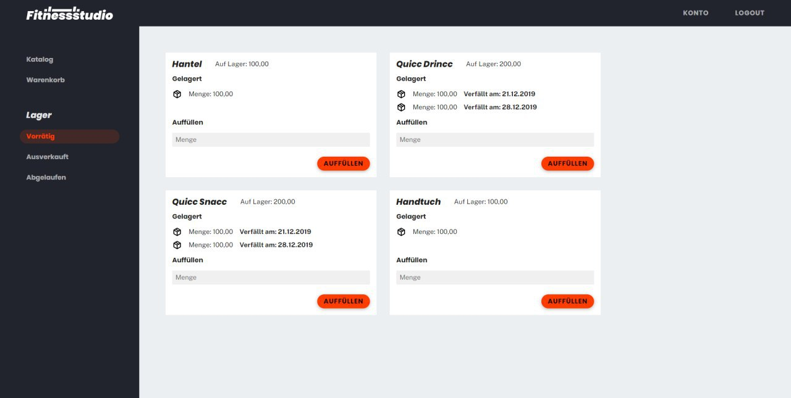
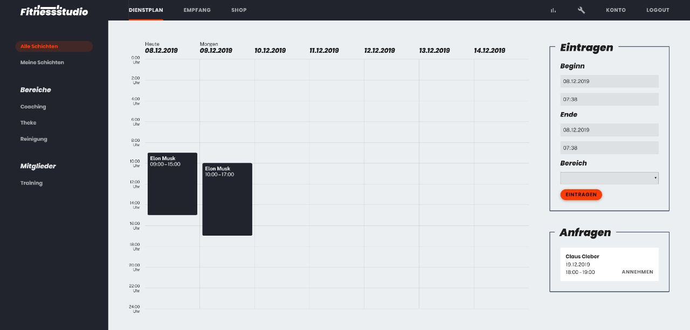

```
___________________                                 _____       _____________
___  ____/__(_)_  /___________________________________  /____  _______  /__(_)_____
__  /_   __  /_  __/_  __ \  _ \_  ___/_  ___/_  ___/  __/  / / /  __  /__  /_  __ \
_  __/   _  / / /_ _  / / /  __/(__  )_(__  )_(__  )/ /_ / /_/ // /_/ / _  / / /_/ /
/_/      /_/  \__/ /_/ /_/\___//____/ /____/ /____/ \__/ \__,_/ \__,_/  /_/  \____/
```

*link:src/main/asciidoc/pflichtenheft.adoc[Pflichtenheft] &mdash;
link:src/main/asciidoc/models/design[Entwurfsklassendiagramm] &mdash;
link:src/main/asciidoc/test_plan.adoc[Test-Plan] &mdash;
link:https://st-lab-ci.inf.tu-dresden.de/[Continuous Integration] &mdash;
link:src/main/asciidoc/developer_documentation.adoc[Entwicklerdokumentation]&mdash;
link:src/main/asciidoc/cross_testing_readme.adoc[Cross Testing]*


== How to run the application?

=== IntelliJ

Run the 'Build & Run' task.

== How to package the application?

Run `./mvnw clean package`. The packaged application (a JAR in `target/`) can be run with `java -jar $jarName`.

== Overview




