[options="header"]
[cols="1, 3, 3"]
|===
|Version | Bearbeitungsdatum   | Autor 
|1.2.0	| 17.01.2020 | Tom Felber, Duy Nhu
|===

= Entwicklerdokumentation

== Einführung und Ziele

=== Aufgabenstellung

Es soll eine Software für den Einsatz in einem Fitnessstudio entwickelt werden.
Dabei sollen verschiedene Geschäftsfelder berücksichtigt werden.

In der Mitarbeiterverwaltung können die Mitarbeiter des Fitnessstudios vom Chef eingestellt,
bearbeitet und entlassen werden. Der Chef legt die verschiedenen Aufgaben und Löhne der Mitarbeiter fest
und kann Urlaubsanträge annehmen bzw. ablehnen. Zusätzlich besitzt er alle Rechte und Funktionalitäten
eines regulären Mitarbeiters.

Die Mitarbeiter sollen eigene Login-Daten bekommen und können ihre persönlichen Daten (Passwort, etc.)
bearbeiten. Alle Mitarbeiter können jederzeit einen tabellarischen Dienstplan einsehen und verändern.
Zum Monatsende wird für jeden Mitarbeiter ein abrufbarer Lohnschein als PDF erstellt. Außerdem können
Mitarbeiter Urlaubsanträge stellen. Alle Mitarbeiter können Mitgliedskonten bearbeiten und/oder deaktivieren.

Neue Mitglieder können sich registrieren (online/lokal) und werden nach Abschluss eines Vertrages
mit einer festen Monatsrate von einem Mitarbeiter freigeschaltet. Danach stellt das Mitglied einen Antrag
auf ein kostenloses Probetraining mit einem Trainer und an einem Zeitpunkt seiner Wahl.
Außerdem erhält jedes neue Mitglied bei seiner Freischaltung einen eigenen Login, um den Termin des
Probetrainings z.B. auch über die Webseite zu vereinbaren bzw. nachzuschlagen. Weiterhin kann jedes
Mitglied seine persönlichen Daten auf der Webseite ändern oder z.B. sich die Rechnung des vorherigen Monats
per PDF ausgeben lassen.

Wirbt ein Mitglied ein neues Mitglied wird ihm ein bestimmter Betrag auf sein Kundenkonto gutgeschrieben,
welches er nur an der Theke verbrauchen kann und nicht ausgezahlt wird. Jedes Mitgliedschaft kann pro
Jahr für einen Monat ohne Gründe ausgesetzt werden.

Des Weiteren gibt es einen Eingangsbereich, dort meldet sich jedes Mitglied, bei einem Mitarbeiter,
bei Betreten des Studios an und bei verlassen ab. An der Theke können Mitglieder auch Getränke,
Nahrungsergänzungsmittel oder Zubehör erwerben, diese werden bar bezahlt oder direkt vom
Kundenkonto abgebucht. Am Ende des Monats wird für jedes Mitglied eine Rechnung über die laufenden Kosten Kundenkonto als
PDF erstellt.

Die Artikel des Verkaufsbereiches müssen sich ebenfalls durch einen Mitarbeiter verwalten lassen.
Es müssen Artikel hinzugefügt, bearbeitet und gelöscht werden können. Bei unterschreiten der Mindestmenge
werden Artikel farblich markiert. Lebensmittel, welche für den Verzehr gedacht sind, haben ein Verfallsdatum,
welches bei jedem Programmstart überprüft werden soll. Für verschiedene Artikel soll der Chef für einen
bestimmten Zeitraum einen Rabatt angeben können.

Ebenfalls sollen Statistiken über laufende Kosten, Einnahmen, Kundenverhalten
und Verkaufsartikel für den Chef grafisch dargestellt werden.

Verschiedene Einstellungen wie monatliche Gebühren,
Neuwerbungsprämie, Öffnungszeiten usw. sollen sich einfach global vom Chef verändern
lassen.

=== Qualitätsziele

Die folgende Tabelle stellt die verschiedenen Qualitätsziele und jeweils deren Prioritäten dar.
Die jeweilige Priorität ist in der entsprechenden Spalte mit einem `x` markiert.

1 = Niedrigste Priorität ..
5 = Höchste Priorität
[options="header", cols="3h, ^1, ^1, ^1, ^1, ^1, ^1"]
|===
| Qualitätsziel | 1 | 2 | 3 | 4 | 5 | Beschreibung
| Wartung _(Maintainability)_ |   |   |   | `x` |
a| Mit wie viel Aufwand ist die Administration der Webseite verbunden
| Benutzerfreundlichkeit _(Usability)_ |   |   |   | `x` |
a| Wie intuitiv ist die Bedienung der Website
| Sicherheit _(Security)_|   |   | `x` |   |
a| Wie sicher sind Daten (insbesondere Passwörter) vor Hackangriffen
| Gestaltung _(Design)_ | `x` |   |   |   |
a| Wieviel Wert wird auf das visuelle Äußere der Webseite gelegt
| Performance | `x` |   |   |   |
a| Die Software sollte performant sein
| Kompatibilität _(Compatibility)_ |   | `x` |   |   |
a| Unterstützung veralteter Technologien. Hier: Welche Browser werden unterstützt
| Portabilität _(Portability)_ | `x` |   |   |   |
a| Die Software sollte sich einfach zwischen verscheidenen Systemen und Umgebungen übertragen lassen
| Erweiterungsfähigkeit _(Expandability)_ |   |   |   | `x` |
a| Die Software sollte erweiterbar sein
| Zuverlässigkeit _(Reliability)_ |   |   |   |   | `x`
a| Die Software sollte keine Fehler produzieren oder abstürzen
| Funktionalität _(Functional Suitability)_ |   |   |   |   | `x`
a| Die Software erfüllt alle geforderten Funktionen
|===

== Randbedingungen

=== Hardware-Vorgaben

* Server
* Computer
* Tastatur
* Mouse

=== Software-Vorgaben

*Empfohlene Java Version:* Java 12

*Mindest Java Version:* Java 11

==== Unterstützte und geprüfte Browser

* Chrome 57 und neuer
* Firefox 52 und neuer

==== Unterstützte, jedoch nicht geprüfte Browser

* Safari 10.1 und neuer
* Edge 16 und neuer
* Opera 44 und neuer

==== Nicht-unterstützte Browser

* Internet Explorer

*Achtung!* Mobilgeräte werden ebenfalls nicht unterstützt!

=== Vorgaben zum Betrieb des Software

== Kontextabgrenzung

=== Kontextdiagramm

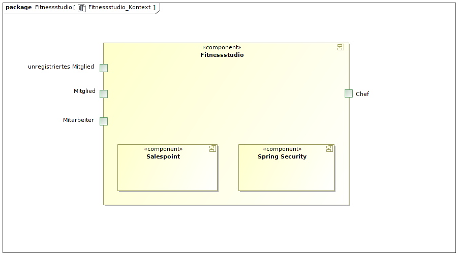

== Lösungsstrategie

=== Erfüllung der Qualitätsziele
[options="header"]
|=== 
|Qualitätsziel |Lösungsansatz
|Wartung _(Maintainability)_ a|
* *Modularität* Aufbau der Applikation aus diskreten Komponenten, sodass Änderungen einer Komponente geringst mögliche Auswirkungen haben.
* *Wiederverwendbarkeit* Hohe Wiederverwendbarkeit der Komponenten.

|Benutzerfreundlichkeit _(Usability)_ a|
* *Lernbarkeit* Sicherstellen, dass das Benutzen der Anwendung intuitiv ist (z.B. durch übersichtliche Dokumentation/Design).
* *Fehlerbehandlung* Den Nutzer vor eigenen Fehlern schützen bzw. diese möglichst früh erkennen und den Benutzer darauf hinweisen.

|Sicherheit _(Security)_ a|
* *Vertraulichkeit* Sicherstellen, dass auf Daten nur von berechtigten Nutzern zugegriffen werden kann (z.B. mit _Spring Security_ und _Thymeleaf_ (`sec:authorize` - tag)).
* *Integrität* Verhindern von unerlaubten Modifikationen an Daten (z.B. mit _Spring Security_ (`@PreAuthorize` - Annotation))
* *Verantwortung* Sicherstellen der Nachvollziehbarkeit von Handlungen (z.B. eine Bestellung ist immer an einen Kunden geknüpft).

|Gestaltung _(Design)_ a|
* *Ästhetik der Benutzeroberfläche* Angenehmes, übersichtliches und zufriedenstellendes Design.

|Performance a|
* *Sparsamkeit an Operationen* Unterbinden von redundanten Operationen bzw. der Speicherung redundanter Informationen (z.B. Generierung der PDFs erst bei expliziter Anfrage und nicht nach jeder Transaktion).

|Kompatibilität _(Compatibility)_ a|
* *Unterstützung von Browsern* Testen der Applikation in den Browsern, die offiziel unterstützt werden (siehe 'Unterstützte und geprüfte Browser').

|Portabilität _(Portability)_ a|
* *Verwendbarkeit auf verschiedenen Systemen* Schreiben der Applikation in einer Sprache, die nicht an ein System gebunden ist (Java).

|Erweiterungsfähigkeit _(Expandability)_ a|
* *Modifizierbarkeit* Sicherstellen, dass Anwendung und ihre Komponenten ohne großen Aufwand oder Fehler skalierbar sind.

|Zuverlässigkeit _(Reliability)_ a|
* *Tests* Testen der Anwendung durch Unit- und Integrationstests, um das Quality Gate zu erfüllen.

|Funktionalität _(Functional Suitability)_ a|
* *Erfüllung der Anforderungen* Regelmäßiger Abgleich des aktuellen Stands mit den Anforderungen des Kunden.
|===

=== Softwarearchitektur
// Beschreibung der Architektur anhand der Top-Level-Architektur oder eines Client-Server-Diagramms

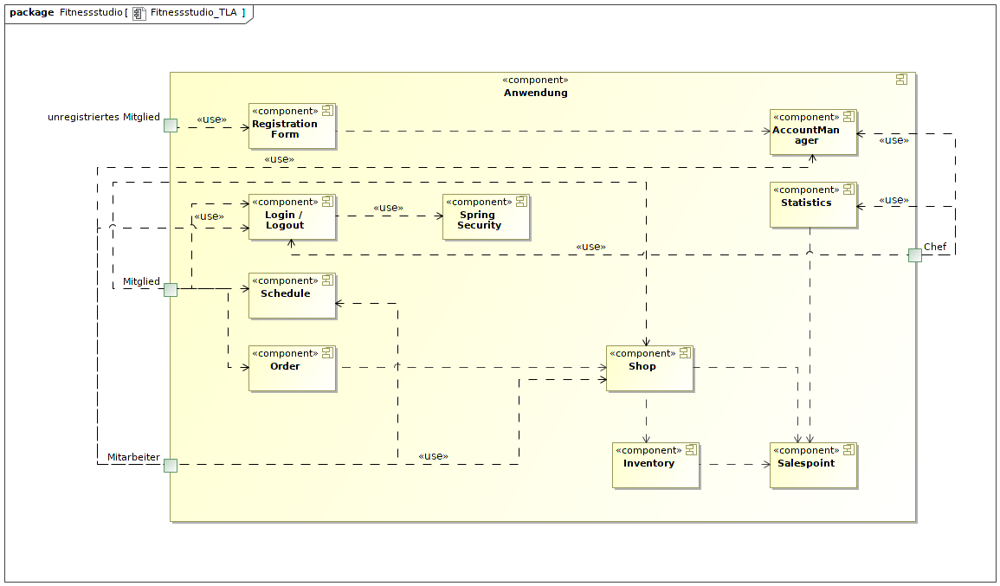

=== Entwurfsentscheidungen
==== Verwendete Muster
* Spring MVC

==== Persistenz
Die Anwendung nutzt "*Hibernate annotation based mapping*" um Java Klassen auf Datenbankeinträge abzubilden. Dafür wird die Datenbank *H2* benutzt.
Standardmäßig ist die Persistierung dekativiert. Um sie zu aktivieren, müssen die folgenden Zeilen in der _application.properties_ entkommentiert werden:
....
# spring.datasource.url=jdbc:h2:./db/fitnessstudio
# spring.jpa.hibernate.ddl-auto=update
....

==== Verwendung externer Frameworks

[options="header", cols="1,3,3"]
|===
|Externe Klasse |Pfad der externen Klasse |Verwendet von (Klasse der eigenen Anwendung)

|Spring.Model |org.springframework.ui.Model a|
* contract.ContractController
* coupon.CouponController
* desk.DeskController
* properties.PropertiesController
* schedule.employee.holiday.HolidayController
* schedule.ScheduleController
* shop.catalog.CatalogController
* shop.discounts.DiscountController
* shop.inventory.InventoryController
* shop.order.OrderController
* statistics.StatisticsController
* user.customer.CustomerController
* user.employee.EmployeeController
* user.UserController
* fitnessstudio.FitnessstudioController

|Spring.Errors|org.springframework.validation.Errors a|
* contract.ContractController
* coupon.CouponController
* desk.DeskController
* properties.PropertiesController
* schedule.employee.holiday.HolidayController
* schedule.ScheduleController
* shop.catalog.CatalogController
* shop.discounts.DiscountController
* shop.inventory.InventoryController
* shop.order.OrderController
* statistics.StatisticsController
* user.customer.CustomerController
* user.employee.EmployeeController
* user.UserController
* fitnessstudio.FitnessstudioController

|Spring.CrudRepository|org.springframework.data.repository.CrudRepository a|
* contracts.ContractRepository
* coupon.CouponRepository
* schedule.customer.suspension.SuspensionRepository
* schedule.customer.training.TrainingRepository
* schedule.customer.trial.TrialRequestRepository
* schedule.employee.holiday.HolidayRepository
* schedule.employee.shift.ShiftRepository
* statistics.repository.CustomerActivityRepository
* statistics.repository.RestockActivityRepository
* user.customer.CustomerRepository
* user.employee.EmployeeRepository

|Spring.Streamable|org.springframework.data.util.Streamable a|
* schedule.customer.suspension.SuspensionRepository
* schedule.customer.training.TrainingRepository
* schedule.customer.trial.TrialRequestRepository
* schedule.employee.holiday.HolidayRepository
* schedule.employee.shift.ShiftRepository
* schedule.Schedule
* statistics.repository.CustomerActivityRepository
* statistics.repository.RestockActivityRepository
* statistics.StatisticsController
* user.customer.CustomerRepository
* user.employee.Employee
* user.employee.EmployeeRepository
* user.UserManager

|Spring.HttpStatus|org.springframework.http.HttpStatus a|
* desk.DeskController
* shop.order.OrderController
* user.customer.CustomerController
* user.employee.EmployeeController
* user.UserController

|Spring.HttpHeaders|org.springframework.http.HttpHeaders a|
* user.UserController

|Spring.MediaType|org.springframework.http.MediaType a|
* user.UserController

|Spring.Converter|org.springframework.core.convert.converter.Converter a|
* schedule.employee.shift.department.DepartmentConverter
* schedule.request.RequestStatusConverter

|Spring.ResponseStatusException|org.springframework.web.server.ResponseStatusException a|
* desk.DeskController
* shop.order.OrderController
* user.customer.CustomerController
* user.employee.EmployeeController
* user.UserController

|Spring.ResponseEntity|org.springframework.http.ResponseEntity a|
* user.UserController

|Spring.SecurityContextHolder|org.springframework.security.core.context.SecurityContextHolder a|
* user.UserController

|Spring.BCryptPasswordEncoder|org.springframework.security.crypto.bcrypt.BCryptPasswordEncoder a|
* user.UserController

|Spring.ClassPathResource|org.springframework.core.io.ClassPathResource a|
* properties.FitnessstudioProperties

|Spring.DefaultPropertiesPersister|org.springframework.util.DefaultPropertiesPersister a|
* properties.FitnessstudioProperties

|Spring.Assert|org.springframework.util.Assert a|
* schedule.ScheduleController
* schedule.ScheduleDataInitializer
* shop.catalog.CatalogDataInitializer
* user.UserDataInitializer

|Spring.SpringApplication|org.springframework.boot.SpringApplication a|
* fitnessstudio.Fitnessstudio

|Spring.HttpSecurity|org.springframework.security.config.annotation.web.builders.HttpSecurity a|
* fitnessstudio.Fitnessstudio

|Spring.AntPathRequestMatcher|org.springframework.security.web.util.matcher.AntPathRequestMatcher a|
* fitnessstudio.Fitnessstudio

|Spring.ViewControllerRegistry|org.springframework.web.servlet.config.annotation.ViewControllerRegistry a|
* fitnessstudio.Fitnessstudio

|Spring.WebMvcConfigurer|org.springframework.web.servlet.config.annotation.WebMvcConfigurer a|
* fitnessstudio.Fitnessstudio

|Salespoint.DataInitializer|org.salespointframework.core.DataInitializer a|
* contracts.ContractDataInitializer
* schedule.ScheduleDataInitializer
* shop.catalog.CatalogDataInitializer
* user.UserDataInitializer

|Salespoint.Product|org.salespointframework.catalog.Product a|
* coupon.Coupon
* shop.order.OrderController

|Salespoint.Currencies|org.salespointframework.core.Currencies a|
* coupon.CouponController

|Salespoint.Cart|org.salespointframework.order.Cart a|
* coupon.CouponController
* shop.catalog.CatalogController
* shop.order.OrderController

|Salespoint.CartItem|org.salespointframework.order.CartItem a|
* shop.catalog.CatalogController
* shop.order.OrderController

|Salespoint.Catalog|org.salespointframework.catalog.Catalog a|
* shop.catalog.CatalogManager

|Salespoint.Quantity|org.salespointframework.quantity.Quantity a|
* shop.catalog.CatalogController
* shop.order.OrderController

|Salespoint.Order|org.salespointframework.order.Order a|
* coupon.CouponController
* shop.order.OrderController
* statistics.StatisticsController
* user.customer.Customer
* user.UserController

|Salespoint.OrderManager|org.salespointframework.order.OrderManager a|
* coupon.CouponController
* shop.order.OrderController
* statistics.StatisticsController
* user.customer.Customer
* user.UserController

|Salespoint.OrderStatus|org.salespointframework.order.OrderStatus a|
* statistics.StatisticsController
* shop.order.OrderController
* user.customer.Customer

|Salespoint.OrderLine|org.salespointframework.order.OrderLine a|
* shop.order.OrderController
* user.customer.Customer

|Salespoint.UserAccount|org.salespointframework.useraccount.UserAccount a|
* coupon.CouponController
* schedule.ScheduleController
* shop.order.OrderController
* user.customer.Customer
* user.customer.CustomerController
* user.customer.CustomerRepository
* user.employee.Employee
* user.employee.EmployeeController
* user.employee.EmployeeRepository
* user.User
* user.UserController
* user.UserManager

|Salespoint.UserAccountManager|org.salespointframework.useraccount.UserAccountManager a|
* user.customer.CustomerController
* user.employee.EmployeeController
* user.UserController
* user.UserDataInitializer
* user.UserManager

|Salespoint.ProductIdentifier|org.salespointframework.catalog.ProductIdentifier a|
* coupon.CouponRepository
* shop.order.OrderController

|Salespoint.BusinessTime|org.salespointframework.time.BusinessTime a|
* desk.DeskController
* schedule.ScheduleController
* shop.catalog.CatalogController
* shop.order.OrderController
* user.customer.Customer
* user.employee.Employee
* user.UserController

|Salespoint.Interval|org.salespointframework.time.Interval a|
* schedule.Schedule
* user.customer.Customer
* user.employee.Employee

|Salespoint.Cash|org.salespointframework.payment.Cash a|
* shop.order.OrderController

|Salespoint.Password|org.salespointframework.useraccount.Password a|
* user.UserManager

|Salespoint.Role|org.salespointframework.useraccount.Role a|
* user.UserManager

|Salespoint.SalespointSecurityConfiguration|org.salespointframework.SalespointSecurityConfiguration a|
* fitnessstudio.Fitnessstudio
|===

== Bausteinsicht

=== Fitnessstudio

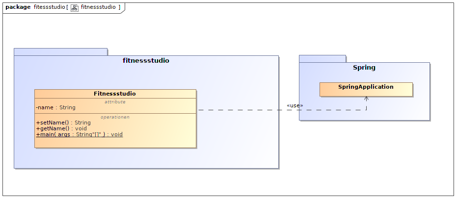

=== Contracts

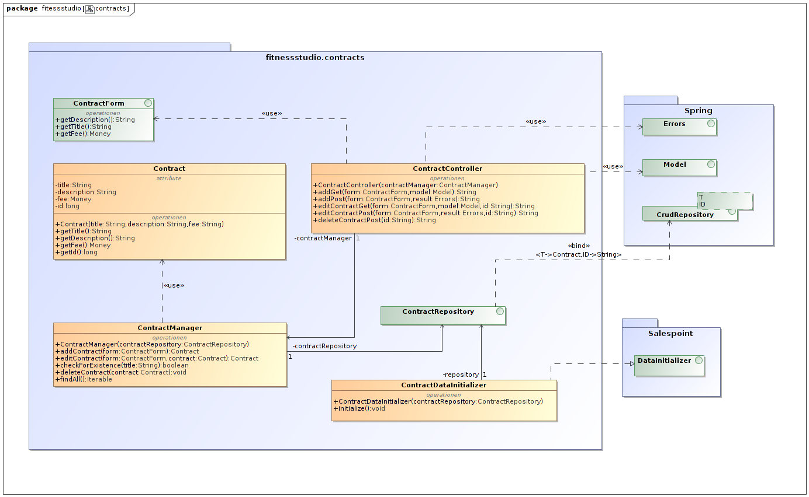

|===
| Klasse/Enumeration | Description

| ContractController |  Die Controllerklasse zur Verwaltung von Anfragen bezüglich der Verträge
| Contract |  Die Repräsentation eines Vertrages
| ContractManager | Klasse zur Verwaltung der Verträge
| ContractRepository |  Interface zur Interaktion mit der Datenbank, um Verträge zu speichern
| ContractForm |  Hilfsklasse, um Nutzereingaben bezüglich der Verträge zu bearbeiten
| ContractDataInitializer | Initialisiert Muster-Verträge zu Testzwecken.
|===

=== User

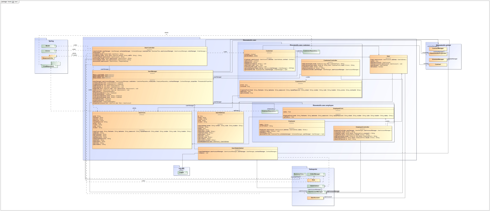

|===
| Klasse/Enumeration | Description
| UserController | Die Controllerklasse für Userinteraktionen bezüglich der Accounts 
| User | Die Repräsentation eines Users
| UserForm | Hilfklasse, die die Nutzerdatenbearbeitung ermöglicht
| UserManager | Die Klasse zur Verwaltung des Users
| UserAddress | Die Repräsentation einer Adresse eines Users
| UserDataInitializer | Initialisiert Userdaten zu Testzwecken
| Customer | User-vererbte Klasse, die einen Customer repräsentiert
| CustomerController | Die Controllerklasse für Customerinteraktionen bezüglich ihrer Accounts
| CustomerRepository | Interface zur Interaktion mit der Datenbank, um Customer zu speichern
| CustomerForm | Hilfklasse, die die Customerdatenbearbeitung ermöglicht
| Employee | User-vererbte Klasse, die einen Employee repräsentiert
| EmployeeRepository | Interface zur Interaktion mit der Datenbank, um Employee zu speichern
| EmployeeController | Die Controllerklasse für Employeeinteraktionen bezüglich ihrer Accounts
| EmployeeForm | Hilfklasse, die die Employeedatenbearbeitung ermöglicht
|===

=== Schedule

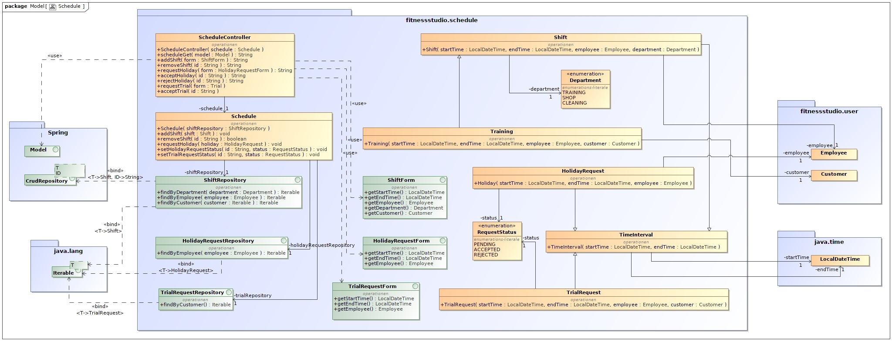

|===
| Klasse/Enumeration | Description

| Suspension a|
 * repräsentiert eine Aussetzung der Mitgliedschaft eines Kunden
| SuspensionForm a|
* ist eine Hilfsklasse zur Sammlung von Nutzereingaben für die Interaktion mit `Suspension`
| SuspensionRepository a|
* Interface für die Datenbankinteraktion mit `Suspension`-Objekten 
| Training a|
* repräsentiert ein Training eines Kunden
| TrainingForm a|
* ist eine Hilfsklasse zur Sammlung von Nutzereingaben für die Interaktion mit `Training`
| TrainingRepository a|
* Interface für die Datenbankinteraktion mit `Training`-Objekten
| TrialRequest a|
* repräsentiert die Anfrage eines Kunden auf ein Probetraining
| TrialRequestForm a|
* ist eine Hilfsklasse zur Sammlung von Nutzereingaben für die Interaktion mit `TrialRequest`
| TrialRequestRepository a|
* Interface für die Datenbankinteraktion mit `TrialRequest`-Objekten
| CustomerForm a|
* ist die Elternklasse aller Formklassen bezüglich des Kunden
| Holiday a|
* repräsentiert einen Urlaub eines Mitarbeiters
| HolidayController a|
* ist eine Controllerklasse für alle Nutzerinteraktionen mit den Urlauben im Dienstplan
| HolidayForm a|
* ist eine Hilfsklasse zur Sammlung von Nutzereingaben für die Interaktion mit `Holiday`
| HolidayRepository a|
* Interface für die Datenbankinteraktion mit `Holiday`-Objekten
| Department a|
* Enumeration, welche die verschiedenen Bereiche dekodiert in denen eine `Shift` stattfinden kann
| DepartmentConverter a|
* Hilfsklasse für Interaktion mit `Department`
| Shift a|
* repräsentiert eine Arbeitszeit eines Mitarbeiters
| ShiftForm a|
* ist eine Hilfsklasse zur Sammlung von Nutzereingaben für die Interaktion mit `Shift`
| ShiftRepository a|
* Interface für die Datenbankinteraktion mit `Shift`-Objekten
| EmployeeForm a|
* ist die Elternklasse aller Formklassen bezüglich des Mitarbeiters
| ScheduleEntry a|
* repräsentiert einen Eintrag in den Dienstplan
| ScheduleEntryForm a|
* ist eine Hilfsklasse zur Sammlung von Nutzereingaben für die Interaktion mit `ScheduleEntry`
| RequestStatus a|
* Enumeration, welche verschiedene Staten, die eine Anfrage im Dienstplan haben kann, dekodiert
| RequestStatusConverter a|
* Hilfsklasse für Interaktion mit `RequestStatus`
| Schedule a|
* Hilfsklasse für die Validierung von Dienstplaneinträgen
| ScheduleController a|
* ist eine Controllerklasse für alle Nutzerinteraktionen mit dem Dienstplan
| ScheduleDataInitializer a|
* Initialisierer-Klasse für den Dienstplan
| ScheduleManager a|
* Managerklasse für den Dienstplan, welche Datenbankinteraktion steuert
|===

=== Shop

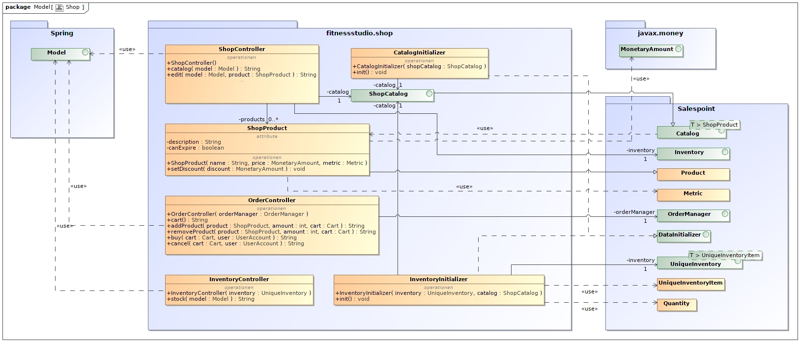

|===
| Klasse/Enumeration | Description

| ShopController |
| OrderController |
| InventoryController |
| ShopCatalog |
| ShopProduct |
| CatalogInitializer |
| InventoryInitializer |
|===

=== Statistics

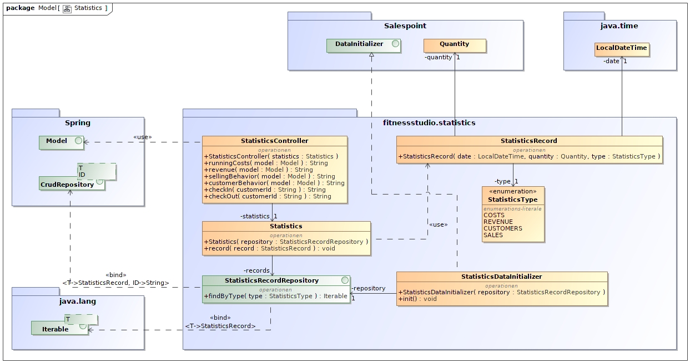

|===
| Klasse/Enumeration | Description

| StatisticsController |
| Statistics |
| StatisticsRecord |
| StatisticsType |
| StatisticsRecordRepository |
| StatisticsDataInitializer |
|===

=== Rückverfolgbarkeit zwischen Analyse- und Entwurfsmodell

|===
| Klasse/Enumeration (Analysemodell) | Klasse/Enumeration (Entwurfsmodell)

| Fitnessclub | Fitnessstudio
| Statistics | Statistics
| User | User
| Customer | Customer
| Employee | Employee
| Boss | Boss
| Contract | Contract
| Account | &mdash;
| Shift | Shift
| Training | Training
| Department | Department
| ShopCatalog | ShopCatalog
| Product | ShopProduct
| OrderManager | OrderManager
| Order | Order
| OrderStatus | OrderStatus
| Cart | Cart
| CartItem | CartItem
| OrderLine | OrderLine
| InventoryItem | InventoryItem
| Inventory | Inventory
|===

== Laufzeitsicht
* Komponentenbezogene Sequenzdiagramme, welche darstellen, wie die Anwendung mit externen Frameworks (zB. Salespoint, Spring) interagiert.

=== Schedule
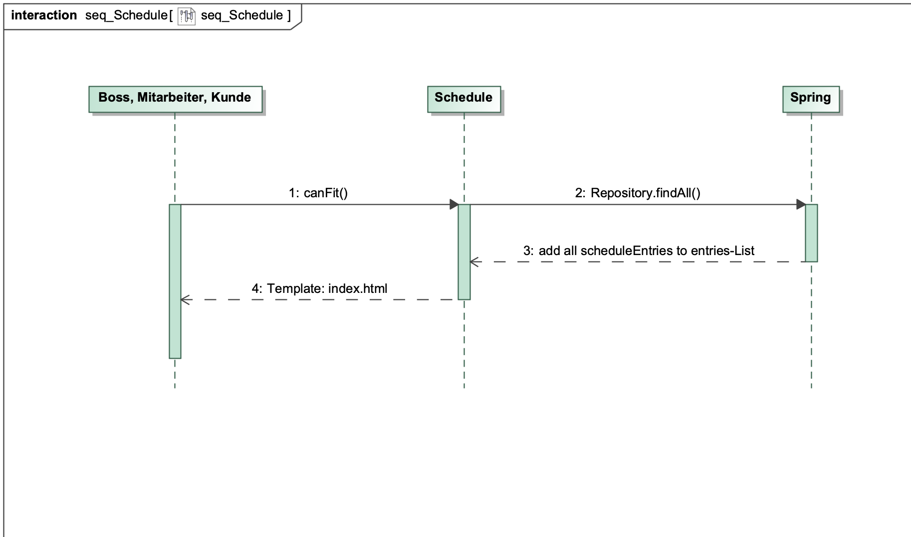

=== Order
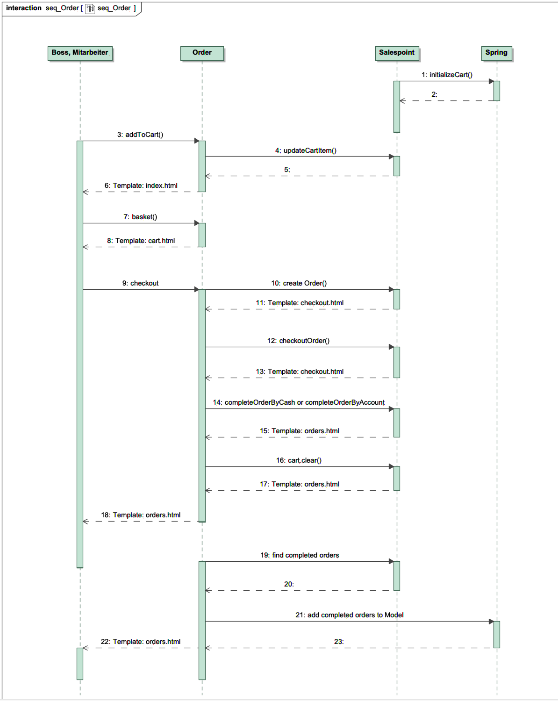

=== Shop
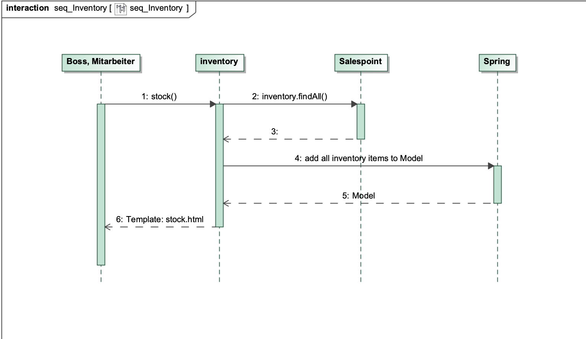

== Technische Schulden
* Auflistung der nicht erreichten Quality Gates und der zugehörigen SonarQube Issues

