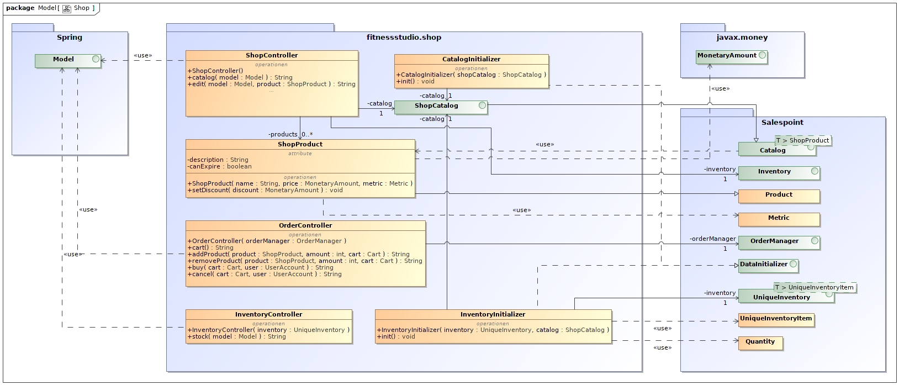

= Artefaktsammlung der Entwurfsphase

In diesem Ordner sind alle in der Entwurfsphase erstellten Diagramme als Bild und zusätzlich das zugrundeliegende Modell zu hinterlegen.

== Übersicht

image::fitnessstudio.png[Fitnessstudio]

image::user.jpg[User]
image::schedule.jpg[Schedule]

image::statistics.jpg[Statistics]