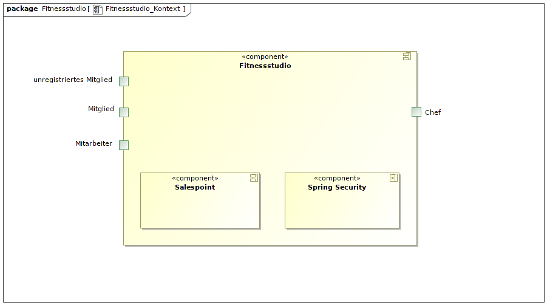

= Pflichtenheft
:project_name: Fitnessstudio
== __{project_name}__

[options="header"]
[cols="1, 1, 1, 5"]
|===
|Version | Status      | Bearbeitungsdatum | Vermerk
|0.1     | Fertig      | 08.11.2019        | Initiale Version
|===

== Inhaltsverzeichnis
. <<zusammenfassung>>
. <<aufgabe>>
. <<produktnutzung>>
. <<interessensgruppen>>
. <<systemgrenze>>
.. <<kontextdiagramm>>
.. <<tla>>
. <<anwendungsfaelle>>
.. <<akteure>>
.. <<ueberblick>>
.. <<anwendungsfallbeschreibungen>>
. <<funktionale-anforderungen>>
.. <<muss>>
.. <<kann>>
. <<nicht-funktionale-anforderungen>>
.. <<qualitaetsziele>>
.. <<konkrete-nicht-funktionale-anforderungen>>
. <<gui>>
.. <<dialoglandkarte>>
.. <<dialogbeschreibungen>>
. <<datenmodell>>
.. <<klassendiagramm>>
.. <<klassen>>
. <<akzeptanztestfaelle>>
. <<glossar>>
. <<offenes>>

:numbered:

[#zusammenfassung]
== Zusammenfassung
Dieses Dokument repräsentiert die Software Requirements Specification (Pflichtenheft) des Projekts
**{project_name}** im Rahmen des Softwarepraktikums der TU Dresden. Es gibt einen Überblick über diese
Software und dient als Grundlage für die Kommunikation zwischen den Interessensgruppen des Projekts,
insbesondere dem Kunden und dem Entwicklungsteam.

[#aufgabe]
== Aufgabenstellung und Zielsetzung
Es soll eine Software für den Einsatz in einem Fitnessstudio entwickelt werden.
Dabei sollen verschiedene Geschäftsfelder berücksichtigt werden.
 
In der Mitarbeiterverwaltung können die Mitarbeiter des Fitnessstudios vom Chef eingestellt,
bearbeitet und entlassen werden. Der Chef legt die verschiedenen Aufgaben und Löhne der Mitarbeiter fest
und kann Urlaubsanträge annehmen bzw. ablehnen. Zusätzlich besitzt er alle Rechte und Funktionalitäten
eines regulären Mitarbeiters.
 
Die Mitarbeiter sollen eigene Login-Daten bekommen und können ihre persönlichen Daten (Passwort, etc.)
bearbeiten. Alle Mitarbeiter können jederzeit einen tabellarischen Dienstplan einsehen und verändern.
Zum Monatsende wird für jeden Mitarbeiter ein abrufbarer Lohnschein als PDF erstellt. Außerdem können
Mitarbeiter Urlaubsanträge stellen. Alle Mitarbeiter können Mitgliedskonten bearbeiten und/oder deaktivieren.
 
Neue Mitglieder können sich registrieren (online/lokal) und werden nach Abschluss eines Vertrages
mit einer festen Monatsrate von einem Mitarbeiter freigeschaltet. Danach stellt das Mitglied einen Antrag
auf ein kostenloses Probetraining mit einem Trainer und an einem Zeitpunkt seiner Wahl.
Außerdem erhält jedes neue Mitglied bei seiner Freischaltung einen eigenen Login, um den Termin des
Probetrainings z.B. auch über die Webseite zu vereinbaren bzw. nachzuschlagen. Weiterhin kann jedes
Mitglied seine persönlichen Daten auf der Webseite ändern oder z.B. sich die Rechnung des vorherigen Monats
per PDF ausgeben lassen.
 
Wirbt ein Mitglied ein neues Mitglied wird ihm ein bestimmter Betrag auf sein Kundenkonto gutgeschrieben,
welches er nur an der Theke verbrauchen kann und nicht ausgezahlt wird. Jedes Mitgliedschaft kann pro 
Jahr für einen Monat ohne Gründe ausgesetzt werden.
 
Des Weiteren gibt es einen Eingangsbereich, dort meldet sich jedes Mitglied, bei einem Mitarbeiter,
bei Betreten des Studios an und bei verlassen ab. An der Theke können Mitglieder auch Getränke,
Nahrungsergänzungsmittel oder Zubehör erwerben, diese werden bar bezahlt oder direkt vom
Kundenkonto abgebucht. Am Ende des Monats wird für jedes Mitglied eine Rechnung über die laufenden Kosten Kundenkonto als
PDF erstellt.
 
Die Artikel des Verkaufsbereiches müssen sich ebenfalls durch einen Mitarbeiter verwalten lassen.
Es müssen Artikel hinzugefügt, bearbeitet und gelöscht werden können. Bei unterschreiten der Mindestmenge
werden Artikel farblich markiert. Lebensmittel, welche für den Verzehr gedacht sind, haben ein Verfallsdatum,
welches bei jedem Programmstart überprüft werden soll. Für verschiedene Artikel soll der Chef für einen
bestimmten Zeitraum einen Rabatt angeben können.
 
Ebenfalls sollen Statistiken über laufende Kosten, Einnahmen, Kundenverhalten
und Verkaufsartikel für den Chef grafisch dargestellt werden.

Verschiedene Einstellungen wie monatliche Gebühren,
Neuwerbungsprämie, Öffnungszeiten usw. sollen sich einfach global vom Chef verändern
lassen.

[#produktnutzung]
== Produktnutzung
Das fertige Produkt wird in folgenden Kontexten für ein Fitnessstudio Anwendung finden:

- Erarbeitung einer Onlinepräsenz
- Mitarbeiter- und Kundenstammverwaltung
- Dienst- und Trainingsplanung jeweils für Mitarbeiter und Mitglieder
- Logistik eines (Offline-)Shops für Mitglieder
- digitale Auswertung und statistische Darstellung der Geschäftsbilanzen

Die Software soll auf einem Server laufen und über das Internet (über einen Browser) erreichbar sein.
Außerdem sollen die neusten Version moderner Internetbrowser (Mozilla Firefox, Google Chrome) unterstützt werden.

Die Hauptnutzer der Software sind Mitglieder des Fitnessstudios, welche in der Lage sind typische Online-Anwendung
(Registrierungsformulare, Terminplaner, etc.) zu bedienen, Mitarbeiter, welche im Rahmen ihrer technischen Einweisung alle wichtigen Funktionalitäten beherrschen, sowie ein Administrator (Chef).

Wartungsfreiheit und eine intuitive Bedienung, welche auch mit minimalen technischen Vorkentnissen auskommt, werden
angestrebt.

[#interessensgruppen]
== Interessensgruppen (Stakeholders)
Hier ist jede Gruppe oder Person (real oder juristisch) aufgeführt, die Einfluss auf die Anforderungen an das System hat. In der folgenden Tabelle sind diese Interessengruppen aufgelistet, ihnen wird eine Priorität zugewiesen und ihre übergeordneten Ziele werden beschrieben. Die zugewiesenen Prioritäten reichen von 1 (niedrigste Priorität) bis 5 (höchste Priorität).

[options="header", cols="2, ^1, 5, 4"]
|===
|Name
|Priorität (1..5)
|Beschreibung
|Ziele

|{project_name}
|5
|Hauptkunde dieses Projekts.
a|
- gesteigerte Kundenaquisition durch Onlinepräsenz
- Produktivitätssteigerung Mitarbeiter durch Arbeitserleichterung
- logistische Prozesse im Shop automatisieren
- Lagerbestandsunterschiede für Shop vermeiden

|Mitglieder
|4
|Kunden des Fitnessstudios. (generieren Einkommen)
a|
- gute, freundliche Nutzererfahrung
- intuitive Bedienung der Webseite
- schnelle Verarbeitung von Anträgen, etc.

|Administrator (Chef)
|3
|administriert Endprodukt und Mitarbeiter (le chef)
a|
- Möglichkeit des Überblicks über alle systemrelevanten Daten
- Möglichkeit der Steuerung aller Prozesse

|Entwickler (Gruppe 12, wir)
|3
|Entwickler, welche die Anwendung implementieren, erweitern, etc.
a|
- einfach erweiterbar
- minimaler bis kein Wartungsaufwand
- leicht debuggbar

|Mitarbeiter
|2
|hauptsächliche Nutzer
a|
- Arbeitserleichterung
- intuitive einfache Bedienung
- zuverlässige und leistungsstarke Tools

|===

[#systemgrenze]
== Systemgrenze und Top-Level-Architektur

[#kontextdiagramm]
=== Kontextdiagramm
Das Kontextdiagramm zeigt das geplante Software-System in seiner Umgebung. Zur Umgebung gehören alle Nutzergruppen des Systems und Nachbarsysteme.

[#tla]
=== Top-Level-Architektur

image::./models/analysis/fitnessstudio_tla.png[Fitnessstudio: TLA, 100%, 100%, pdfwidth=100%, title= "Top-Level-Architektur", align=center]

[#anwendungsfaelle]
== Anwendungsfälle

[#akteure]
=== Akteure

// See http://asciidoctor.org/docs/user-manual/#tables
[options="header"]
[cols="1,4"]
|===
|Name |Beschreibung
|User  |repräsentiert alle Personen, die die Software nutzen, unabhängig vom Rechtegrad.
|Chef  |alle registrierten Benutzer, die die Rolle des Chefs besitzen; zuständig für die Verwaltung der Personals und des Fitnessstudios.
|Mitarbeiter |jeder registrierte Nutzer, der als Mitarbeiter fungiert; begleitet unterschiedliche Aufgaben, die für die Funktionsfähigkeit des Studios erforderlich sind.
|Mitglied |jeder registrierte Nutzer, der die Rolle des Mitglieds besitzt; ist der Kunde des Studios und somit die Einnahmeqelle.
|unregistriertes Mitglied |ein unregistriertes Mitglied kann sich registrieren, um ein vollwertiges Mitglied zu werden.
|===

[#ueberblick]
=== Überblick Anwendungsfalldiagramm

[#anwendungsfallbeschreibungen]
=== Anwendungsfallbeschreibungen

|===
|ID                         |**<<UC0010>>**
|Name                       |Login/Logout
|Beschreibung                |Jeder Nutzer sollte sich einloggen können, um auf die Funktionalitäten der Anwendung, passend zu seinem Rechtegrad, zugreifen zu können.
Dieser Prozess soll durch den Logout rückgängig gemacht werden können.
|Actor                     |User
|Trigger                    |
_Login_: Der Nutzer will auf "versteckte" Funktionalitäten zugreifen, indem er sich einloggt.

_Logout_: Der Nutzer will die Anwendung verlassen.
|Voraussetzung(en)           a|
_Login_: Der Nutzer ist bereits registriert und noch nicht eingeloggt

_Logout_: Der Nutzer ist bereits eingeloggt
|Notwendige Schritte           a|
_Login_:

  1. Nutzer begibt sich in den "Einloggen"-Bereich durch Drücken des Buttons
  2. Nutzer gibt seine Daten sein
  3. Nutzer drückt "Login"-Button

_Logout_:

  1. Nutzer drückt den "Logout"-Button
  2. Nutzer wird zum Startbildschirm zurückgebracht und ist nun nicht mehr eingeloggt

|Erweiterungen                 |-
|Funktionale Voraussetzungen    |<<F.0.0.0>>
|===

|===
|ID                         |**<<UC0020>>**
|Name                       |Registrieren
|Beschreibung                |Unregistrierte Mitglieder sollen sich im Fitnessstudio registrieren können, um von da an als "Mitglied" agieren zu können
|Actor                     |Unregistriertes Mitglied
|Trigger                    |Das neue Mitglied möchte sich registrieren und einen Account für sich erstellen.
|Voraussetzung(en)           a|Das Mitglied ist noch nicht registriert.
|Notwendige Schritte           a|
1. Das neue Mitglied begibt sich in den "Registrieren"-Bereich durch Drücken des Buttons
2. Das neue Mitglied gibt die notwendigen Daten ein (Name, Wunschpasswort,...)
3. Das neue Mitglied drückt den "Registrieren"-Button

|Erweiterungen                 | Wenn der Name bereits vergeben ist, erscheint eine Fehlermeldung. Ansonsten wird ein neues Mitglied erstellt.
|Funktionale Voraussetzungen    |<<F.0.1.0>> <<F.1.6.0>>
|===

|===
|ID                         |**<<UC0030>>**
|Name                       |Rechnung über laufende Kosten
|Beschreibung                |Jedes Mitglied kann sich seine Rechung über die laufenden Kosten seines Kontos am Ende des Monats ansehen
|Actor                     |Mitglied
|Trigger                    |Das Mitglied möchte sich seine Rechung ansehen.
|Voraussetzung(en)           a|Das Mitglied ist schon mindestens einen Monat registriert.
|Notwendige Schritte           a|
1. Die Rechnung wird vom System erstellt.
2. Das Mitglied drückt den vorgesehenen Button.
3. Das Mitglied kann sich die Rechnung als PDF-Dokument ansehen.

|Erweiterungen                 |-
|Funktionale Voraussetzungen    |<<F.1.10.0>>
|===

|===
|ID                         |**<<UC0040>>**
|Name                       |Logindaten bearbeiten
|Beschreibung                |Jeder User kann seine Logindaten bearbeiten.
|Actor                     |User
|Trigger                    |Der User möchte seine Logindaten ändern.
|Voraussetzung(en)           a|Der User ist eingeloggt.
|Notwendige Schritte           a|
1. User drückt entsprechenden Button, um in den Bearbeitungsbereich zu gelangen.
2. User ändert seine Daten.
3. User drückt Button, um Änderungen zu speichern.

|Erweiterungen                 |-
|Funktionale Voraussetzungen    |<<F.1.8.0>> <<F.1.8.1>>
|===

|===
|ID                         |**<<UC0050>>**
|Name                       |Antrag auf Probetraining
|Beschreibung                |Frisch registrierte Mitglieder können einen Antrag auf ein kostenloses Probetraining stellen.
|Actor                     |Mitglied
|Trigger                    |Das Mitglied möchte ein Probetraining durchführen.
|Voraussetzung(en)           a|Das Mitglied hatte vorher noch kein Probetraining.
|Notwendige Schritte           a|
1. Mitglied drückt entsprechenden Button, um in den Bereich des Probetrainings zu kommen.
2. Mitglied wählt Wunschtermin und Trainer aus.
3. Mitglied schickt die Anfrage durch Drücken eines Buttons ab.

|Erweiterungen                 |-
|Funktionale Voraussetzungen    |<<F.1.7.0>>
|===

|===
|ID                         |**<<UC0060>>**
|Name                       |Gutschrift
|Beschreibung                |Wird ein Mitglied durch ein anderes angeworben, wird ihm ein Guthaben auf sein Kundenkonto gutgeschrieben.
|Actor                     |Mitglied
|Trigger                    |Mitglied wird durch ein anderes Mitglied angeworben
|Voraussetzung(en)           a|Das angeworbene Mitglied hat noch kein Konto.
|Notwendige Schritte           a|
1. Das angeworbene Mitglied kann bei der Registrierung die Kundennummer des Anwerbers angeben.
2. Ein Guthaben wird auf das Kundenkonto des angeworbenen Mitglieds gutgeschrieben.  

|Erweiterungen                 |-
|Funktionale Voraussetzungen    |<<F.1.11.0>>
|===

|===
|ID                         |**<<UC0070>>**
|Name                       |Dienstplan ansehen/bearbeiten
|Beschreibung                |Jeder Mitarbeiter kann den Dienstplan einsehen und bearbeiten.
|Actor                     |Mitarbeiter/Chef
|Trigger                    |Der Mitarbeiter möchte den Dienstplan ansehen/bearbeiten.
|Voraussetzung(en)           a|Der Handelnde ist als Mitarbeiter/Chef eingeloggt.
|Notwendige Schritte           a|
1. Mitarbeiter drückt entsprechenden Button, um den Dienstplan zu öffnen.
2. Mitarbeiter drückt Button, um Dienstplan zu bearbeiten.
3. Mitarbeiter drückt Button, um Änderungen zu speichern.
4. Dienstplan wird global aktualisiert.

|Erweiterungen                 |-
|Funktionale Voraussetzungen    |<<F.1.5.0>> <<F.1.5.1>> <<F.1.5.2>>
|===

image::./models/analysis/usecase_diagrams/images/dienstplan_ansehen_bearbeiten.png[Sequence diagram: Dienstplan ansehen_bearbeiten, 100%, 100%, pdfwidth=100%, title= "Sequenzdiagramm: Dienstplan ansehen/bearbeiten", align=center]

|===
|ID                         |**<<UC0080>>**
|Name                       |Mitgliedschaft aussetzen
|Beschreibung                |Jedes Mitglied kann seine Mitgliedschaft für einen Monat pro Jahr aussetzen.
|Actor                     |Mitglied
|Trigger                    |Mitglied kann/möchte einen Monat nicht trainieren.
|Voraussetzung(en)           a|Das Mitglied hat dieses Jahr noch keinen Monat ausgesetzt.
|Notwendige Schritte           a|
1. Das Mitglied drückt den entsprechenden Button, um seine Mitgliedschaft auszusetzen.
2. Das Konto des Mitglieds wird für einen Monat "gesperrt".

|Erweiterungen                 |Das Mitglied darf während des Monats nicht trainieren, muss allerdings auch kein Geld bezahlen.
|Funktionale Voraussetzungen    |<<F.1.13.0>>
|===

|===
|ID                         |**<<UC0090>>**
|Name                       |Kundenkonten bearbeiten/deaktivieren
|Beschreibung                |Jeder Mitarbeiter kann Mitgliederkonten bearbeiten und deaktiveren.
|Actor                     |Mitarbeiter/Chef
|Trigger                    |Der Mitarbeiter muss ein Kundenkonto bearbeiten/deaktivieren, aus verschiedenen Gründen.
|Voraussetzung(en)           a|Der Handelnde ist als Mitarbeiter/Chef eingeloggt. Das Kundenkonto existiert.
|Notwendige Schritte           a|
1. Mitarbeiter wählt aus einer Liste das entsprechende Mitgliedkonto aus.
2. Mitarbeiter drückt einen Button, um an die Konteneinstellungen zu gelangen.
3. Mitarbeiter bearbeitet das Konto.
4. Mitarbeiter speichert die Änderungen durch Drücken eines Buttons.

|Erweiterungen                 |-
|Funktionale Voraussetzungen    |<<F.1.4.0>> <<F.1.4.1>>
|===

|===
|ID                         |**<<UC0100>>**
|Name                       |Urlaubsanträge stellen
|Beschreibung                |Jeder Mitarbeiter kann Urlaubsanträge stellen.
|Actor                     |Mitarbeiter/Chef
|Trigger                    |Der Mitarbeiter möchte Urlaub beantragen.
|Voraussetzung(en)           a|Der Handelnde ist als Mitarbeiter/Chef eingeloggt.
|Notwendige Schritte           a|
1. Mitarbeiter drückt entsprechenden Button.
2. Mitarbeiter wählt den gewünschten Zeitraum aus.
3. Mitarbeiter drückt einen Button, um den Antrag abzuschicken.

|Erweiterungen                 |-
|Funktionale Voraussetzungen    |<<F.1.3.0>> <<F.1.3.1>>
|===

|===
|ID                         |**<<UC0110>>**
|Name                       |Lohnschein
|Beschreibung                |Jeder Mitarbeiter kann sich am Monatsende einen Lohnschein als PDF anzeigen und ausdrucken lassen.
|Actor                     |Mitarbeiter/Chef
|Trigger                    |Der Mitarbeiter möchte seinen Lohnschein haben.
|Voraussetzung(en)           a|Der Handelnde ist als Mitarbeiter/Chef eingeloggt.
|Notwendige Schritte           a|
1. Mitarbeiter drückt entsprechenden Button.
2. Lohnschein wird als PDF angezeigt.
3. Mitarbeiter kann den Lohnschein drucken.

|Erweiterungen                 |-
|Funktionale Voraussetzungen    |<<F.1.2.1>>
|===

|===
|ID                         |**<<UC0120>>**
|Name                       |Antrag auf Probetraining bearbeiten
|Beschreibung                |Mitarbeiter müssen die Probetrainingsanträge neuer Mitglieder bearbeiten.
|Actor                     |Mitarbeiter
|Trigger                    |Ein neues Mitglied hat ein Probetraining beantragt.
|Voraussetzung(en)           a|Der Handelnde ist als Mitarbeiter eingeloggt.
|Notwendige Schritte           a|
1. Der Mitarbeiter gelangt durch drücken eines Buttons in den Übersichtsbereich der Probetrainings.
2. Der Mitarbeiter kann durch Drücken entsprechender Buttons Anträge annehmen/ablehnen.

|Erweiterungen                 |-
|Funktionale Voraussetzungen    |<<F.1.7.1>> <<F.1.7.2>>
|===

|===
|ID                         |**<<UC0130>>**
|Name                       |Urlaubsanträge
|Beschreibung                |Der Chef kann Urlaubsanträge bearbeiten.
|Actor                     |Chef
|Trigger                    |Der Chef muss die Urlaubsanträge der Mitarbeiter bearbeiten. 
|Voraussetzung(en)           a|Der Handelnde ist als Chef eingeloggt.
|Notwendige Schritte           a|
1. Der Chef drückt einen Button, um die Urlaubsanträge anzusehen.
2. Der Chef drückt den entsprechenden Button, um den Antrag anzunehmen oder abzulehnen.

|Erweiterungen                 |-
|Funktionale Voraussetzungen    |<<F.1.3.1>>
|===

|===
|ID                         |**<<UC0140>>**
|Name                       |Aufgaben/Löhne festlegen
|Beschreibung                |Der Chef kann die Aufgaben und Löhne der Mitarbeiter festlegen.
|Actor                     |Chef
|Trigger                    |Der Chef muss die Löhne und Aufgaben der Mitarbeiter festlegen. 
|Voraussetzung(en)           a|Der Handelnde ist als Chef eingeloggt.
|Notwendige Schritte           a|
1. Der Chef drückt einen Button, um sich eine Liste aller Mitarbeiter anzeigen zu lassen.
2. Der Chef wählt aus der Liste einen Mitarbeiter aus, um dessen Aufgaben/Lohn festzulegen.
3. Der Chef bearbeitet die nötigen Informationen.
4. Der Chef speichert die Änderungen durch Drücken eines Buttons.

|Erweiterungen                 |-
|Funktionale Voraussetzungen    |<<F.1.1.0>> <<F.1.2.0>>
|===

|===
|ID                         |**<<UC0150>>**
|Name                       |Mitarbeiter einstellen/entlassen
|Beschreibung                |Der Chef kann Mitarbeiter einstellen und entlassen.
|Actor                     |Chef
|Trigger                    |Sollen Mitarbeiter eingestellt oder entlassen werden, kann das nur der Chef machen. 
|Voraussetzung(en)           a|Der Handelnde ist als Chef eingeloggt. Der zu entlassende Mitarbeiter existiert in der Datenbank.
|Notwendige Schritte           a|
_Einstellen:_

	1. Der Chef drückt einen Button, um einen neuen Mitarbeiter einstellen zu können.
	2. Der Chef gibt die nötigen Daten (Name, Passwort, ...) ein, um ein neues Konto zu erstellen.
	3. Der Chef erstellt das neue Konto durch Drücken eines Buttons.

_Entlassen:_

	1. Der Chef drückt einen Button, um sich eine Liste aller Mitarbeiter anzeigen zu lassen.
	2. Der Chef wählt aus der Liste einen Mitarbeiter aus.
	3. Der Chef drückt den entsprechenden Button, um den Mitarbeiter zu entlassen.

|Erweiterungen                 |-
|Funktionale Voraussetzungen    |<<F.1.0.0>> <<F.1.0.3>>
|===

|===
|ID                         |**<<UC0160>>**
|Name                       |Mitarbeiterkonten bearbeiten
|Beschreibung                |Der Chef kann die Konten von Mitarbeitern bearbeiten.
|Actor                     |Chef
|Trigger                    |Der Chef möchte das Konto eines Mitarbeiters bearbeiten.
|Voraussetzung(en)           a|Der Handelnde ist als Chef eingeloggt.
|Notwendige Schritte           a|
1. Der Chef drückt einen Button, um sich eine Liste aller Mitarbeiter anzeigen zu lassen.
2. Der Chef wählt aus der Liste einen Mitarbeiter aus, dessen Konto er bearbeiten möchte und gelangt in ein entsprechendes Formular.
3. Der Chef bearbeitet die Informationen.
4. Der Chef bestätigt die Änderungen durch Drücken eines Buttons.

|Erweiterungen                 |-
|Funktionale Voraussetzungen    |<<F.1.0.1>> <<F.1.0.2>>
|===

|===
|ID                         |**<<UC0170>>**
|Name                       |Statistiken
|Beschreibung                |Der Chef kann Statistiken über den Fitnessclub (Einnahmen, ...) abrufen.
|Actor                     |Chef
|Trigger                    |Der Chef möchte sich die Statistiken des Studios ansehen.
|Voraussetzung(en)           a|Der Handelnde ist als Chef eingeloggt.
|Notwendige Schritte           a|
1. Der Chef drückt einen Button, um in den entsprechenden Bereich zu gelangen.
2. Die Statistiken werden angezeigt.

|Erweiterungen                 |-
|Funktionale Voraussetzungen    |<<F.1.14.0>>
|===

|===
|ID                         |**<<UC0180>>**
|Name                       |Einstellungen verändern
|Beschreibung                |Der Chef kann globale Einstellungen des Fitnessclubs verändern.
|Actor                     |Chef
|Trigger                    |Der Chef möchte globale Einstellungen bearbeiten.
|Voraussetzung(en)           a|Der Handelnde ist als Chef eingeloggt.
|Notwendige Schritte           a|
1. Der Chef drückt einen Button, um in den entsprechenden Bereich zu gelangen.
2. Der Chef bearbeitet die Informationen.
3. Der Chef speichert die Informationen durch Drücken eines Buttons.

|Erweiterungen                 |-
|Funktionale Voraussetzungen    |<<F.1.15.0>> <<F.2.5.0>>
|===

|===
|ID                         |**<<UC0190>>**
|Name                       |Verkäufe verwalten
|Beschreibung                |Die Thekenkraft muss die Artikel verkaufen, die ein Kunde kaufen möchte. 
|Actor                     |Mitarbeiter
|Trigger                    |Ein Mitglied möchte etwas an der Theke kaufen.
|Voraussetzung(en)           a|-
|Notwendige Schritte           a|
1. Ein Mitglied möchte etwas kaufen.
2. Die Thekenkraft nimmt Mitgliednummer entgegen.
3. Die Thekenkraft navigiert durch drücken von Buttons in den Shop.
4. Die Thekenkraft fügt die gewünschten Artikel dem Warenkorb des Mitglieds hinzu.
5. Die Thekenkraft nimmt Geld entgegen, bar oder vom Guthaben.
6. Die Thekenkraft setzt den Status der gekauften Artikel auf bezahlt, durch Drücken entsprechender Buttons.

|Erweiterungen                 |Wird bar bezahlt, wird sofort eine Rechung als PDF erstellt.
|Funktionale Voraussetzungen    |<<F.2.0.0>> <<F.2.1.0>> <<F.2.2.0>> <<F.2.2.1>> <<F.2.2.3>> <<F.2.2.4>> <<F.2.2.5>> <<F.2.3.0>> <<F.2.3.1>> <<F.2.3.2>> <<F.2.3.3>>
|===

|===
|ID                         |**<<UC0200>>**
|Name                       |Artikel verwalten
|Beschreibung                |Mitarbeiter muss die Artikel verwalten, welche zum Verkauf stehen.
|Actor                     |Mitarbeiter
|Trigger                    |Die Mitarbeiter müssen den Bestand kontrollieren und, wenn nötig,  Artikel nachbestellen.
|Voraussetzung(en)           a|Der Handelnde ist als Mitarbeiter eingeloggt.
|Notwendige Schritte           a|
1. Der Mitarbeiter gelangt durch Drücken eines Buttons in den Übersichtsbereich des Inventars.
2. Der Mitarbeiter sieht, wenn Artikel nachbestellt werden müssen.
3. Der Mitarbeiter kann durch Drücken entsprechender Buttons Nachbestellungen tätigen. 

|Erweiterungen                 |-
|Funktionale Voraussetzungen    |<<F.2.0.0>> <<F.2.1.0>> <<F.2.4.0>> <<F.2.4.1>>
|===

|===
|ID                         |**<<UC0210>>**
|Name                       |Anmelden/Abmelden verwalten
|Beschreibung                |Die Thekenkraft muss die Anmeldungen/Abmeldungen von Mitgliedern verwalten.
|Actor                     |Mitarbeiter
|Trigger                    |Die Mitarbeiter müssen den Check-In/Check-Out der Mitglieder an der Theke verwalten.
|Voraussetzung(en)           a|_Anmelden_:
  Mitglied ist registriert und noch nicht angemeldet.

_Abmelden_:
  Mitglied ist angemeldet.
Der Handelnde muss als Mitarbeiter eingeloggt sein.
|Notwendige Schritte           a|
_Anmelden_:

  1. Das Mitglied gibt der Thekenkraft seine Mitgliedsnummer.
  2. Die Thekenkraft navigiert in die Mitgliederverwaltung.
  3. Die Thekenkraft setzt den Status des entsprechenden Mitglieds auf angemeldet.

_Abmelden_:

  1. Das Mitglied gibt der Thekenkraft seine Mitgliedsnummer.
  2. Die Thekenkraft navigiert in die Mitgliederverwaltung.
  3. Die Thekenkraft setzt den Status des entsprechenden Mitglieds auf abgemeldet.

|Erweiterungen                 |-
|Funktionale Voraussetzungen    |<<F.1.12.0>> <<F.1.12.1>>
|===

[#funktionale-anforderungen]
== Funktionale Anforderungen

[#muss]
=== Muss-Kriterien
// Was das zu erstellende Programm auf alle Fälle leisten muss.

|===
| ID | Name | Beschreibung

// [F-0] General
| [[F.0.0.0]]<<F.0.0.0>> | Authentifikation
a| Mitglieder, Mitarbeiter und der Chef können sich mit *E-Mail-Adresse* und *Passwort* authentifizieren.

| [[F.0.1.0]]<<F.0.1.0>> | Registrierung
a| Neue Kunden können sich in einem Formular registrieren.

Dazu werden folgende Daten benötigt:

- E-Mail-Adresse
- Vor- und Nachname

| [[F.0.2.0]]<<F.0.2.0>> | Statistik
a| Es soll eine Statistik über

- laufende Kosten
- Einnahmen
- Kundenverhalten
- Verkaufsverhalten

gehalten und gespeichert werden.

// [F-1] Management
| [[F.1.0.0]]<<F.1.0.0>> | Mitarbeiter einstellen
a| Der Chef kann neue Mitarbeiterkonten erstellen und vergeben.

Dazu benötigt er *Vor-* und *Nachname*, sowie die *E-Mail-Adresse* des Mitarbeiters.

| [[F.1.0.1]]<<F.1.0.1>> | Mitarbeiter ansehen
a| Der Chef kann die persönlichen Daten eines Mitarbeiters ansehen.

| [[F.1.0.2]]<<F.1.0.2>> | Mitarbeiter bearbeiten
a| Der Chef kann die persönlichen Daten eines Mitarbeiters ändern.

| [[F.1.0.3]]<<F.1.0.3>> | Mitarbeiter entlassen
a| Der Chef kann einen Mitarbeiter entlassen indem er das Konto des Mitarbeiters deaktiviert.

| [[F.1.1.0]]<<F.1.1.0>> | Aufgaben zuordnen
a| Der Chef kann einem Mitarbeiter eine Aufgabe als *Trainer* (`TRAINER`), *Verkäufer* (`SHOPKEEPER`) oder *Reinigungskraft* (`JANITOR`) zuordnen.

| [[F.1.2.0]]<<F.1.2.0>> | Lohn festlegen
a| Der Chef kann den Lohn eines Mitarbeiters bestimmen.

| [[F.1.2.1]]<<F.1.2.1>> | Lohnschein anzeigen
a| Ein Mitarbeiter kann jederzeit den Lohnschein des vorherigen Monats als *PDF* anzeigen lassen und herunterladen.

| [[F.1.3.0]]<<F.1.3.0>> | Urlaubsantrag stellen
a| Ein Mitarbeiter kann einen Urlaubsantrag stellen.

| [[F.1.3.1]]<<F.1.3.1>> | Urlaubsantrag bearbeiten
a| Der Chef kann einen von einem Mitarbeiter gestellten Urlaubsantrag *annehmen* oder *ablehnen*.

| [[F.1.4.0]]<<F.1.4.0>> | Mitgliedskonten deaktivieren
a| Ein Mitarbeiter kann das Konto eines Mitglieds deaktivieren.

// [[F.1.4.1]] <- Kann-Abschnitt

| [[F.1.5.0]]<<F.1.5.0>> | Dienstplan
a| Die Software soll einen zentralen Dienstplan in Form eines Kalenders zur Verfügung stellen.

| [[F.1.5.1]]<<F.1.5.1>> | Dienstplan ansehen
a| Mitarbeiter können die Schichten aller Mitarbeiter auf dem Dienstplan einsehen.

| [[F.1.5.2]]<<F.1.5.2>> | Dienstplan bearbeiten
a| Mitarbeiter können ihre eigenen Schichten bearbeiten und neue Schichten in den Dienstplan eintragen.

| [[F.1.6.0]]<<F.1.6.0>> | Vertrag auswählen
a| Bei der Registrierung hat der Kunde die Auswahl zwischen verschiedenen Verträgen, von denen einer ausgesucht wird.

| [[F.1.7.0]]<<F.1.7.0>> | Antrag auf Probetraining stellen
a| Ein Mitglied kann *einmalig* einen Antrag auf ein Probetraining stellen.

| [[F.1.7.1]]<<F.1.7.1>> | Antrag auf Probetraining ansehen
a| Ein Mitarbeiter kann gestellte Probetrainingsanträge ansehen.

| [[F.1.7.2]]<<F.1.7.2>> | Antrag auf Probetraining annehmen
a| Ein Mitarbeiter kann einen Antrag auf ein Probetraining annehmen.

| [[F.1.8.0]]<<F.1.8.0>> | Persönliche Daten ansehen
a| Ein Mitglied kann seine persönlichen Daten ansehen.

| [[F.1.8.1]]<<F.1.8.1>> | Persönliche Daten und Passwort ändern
a| Ein Mitglied kann seine persönlichen Daten und sein Passwort bearbeiten.

| [[F.1.9.0]]<<F.1.9.0>> | Trainingszeiten einsehen
a| Ein Mitglied kann sich eine Übersicht über seine Trainingszeiten anzeigen lassen.

| [[F.1.10.0]]<<F.1.10.0>> | Rechnungen anzeigen
a| Ein Mitglied kann jederzeit die Rechnung des vorherigen Monats als *PDF* anzeigen lassen und herunterladen.

| [[F.1.11.0]]<<F.1.11.0>> | Anwerbung
a| Neue Kunden, die von einem Mitglied angeworben wurden, können bei der Registrierung die Kundennummer dieses Mitglieds angeben.

| [[F.1.11.1]]<<F.1.11.1>> | Anwerbeprämie erhalten
a| Ein Mitglied erhält einen Betrag auf sein Kundenkonto gutgeschrieben, wenn ein neuer Kunde dessen Kundennummer bei der Registrierung angibt.

| [[F.1.12.0]]<<F.1.12.0>> | Check-In
a| Ein Mitglied kann bei einem Mitarbeiter mit seiner Kundennummer zum Training einchecken.

| [[F.1.12.1]]<<F.1.12.1>> | Check-Out
a| Ein Mitglied kann bei einem Mitarbeiter mit seiner Kundennummer nach dem Training auschecken.

| [[F.1.13.0]]<<F.1.13.0>> | Mitgliedschaft aussetzen
a| Ein Mitglied kann jedes Jahr für einen Monat die Mitgliedschaft ohne Grund aussetzen.

| [[F.1.14.0]]<<F.1.14.0>> | Statistik ansehen
a| Der Chef kann sich eine grafische Darstellung der Statistiken anzeigen lassen.

| [[F.1.15.0]]<<F.1.15.0>> | Geschäftsverwaltung
a| Der Chef kann Einstellungen, wie

- monatliche Gebühren
- Neuwerbungsprämie
- Öffnungszeiten

global anpassen.

// [F.2] Salespoint
| [[F.2.0.0]]<<F.2.0.0>> | Produktübersicht (_Catalog_)
a| Ein Verkäufer hat eine Übersicht über die Zusammenfassung aller Produkte.

| [[F.2.1.0]]<<F.2.1.0>> | Produkt (_Product_)
a| Es werden folgende verschiedene Produkte zum Verkauf angeboten:

- Getränke
- Nahrungsergänzungsmittel
- Zubehör

Produkte können verdeblich sein bzw. ein Verfallsdatum haben.

| [[F.2.2.0]]<<F.2.2.0>> | Warenkorb (_Cart_)
a| Es kann für jeden einzelnen Verkäufer ein Warenkorb temporär gespeichert werden.

| [[F.2.2.1]]<<F.2.2.1>> | Produkt zum Warenkorb hinzufügen
a| Ein Verkäufer kann eine bestimmte Anzahl eines Produkts zum Warenkorb hinzufügen.

| [[F.2.2.3]]<<F.2.2.3>> | Produkt aus Warenkorb entfernen
a| Ein Verkäufer kann ein Produkt aus dem Warenkorb entfernen.

| [[F.2.2.4]]<<F.2.2.4>> | Warenkorb ansehen
a| Ein Verkäufer kann die Produkte im Warenkorb ansehen.

| [[F.2.2.5]]<<F.2.2.5>> | Produkte in einem Warenkorb kaufen
a| Ein Verkäufer kann Produkte, die in einem Warenkorb liegen, als eingekauft kennzeichnen.

| [[F.2.3.0]]<<F.2.3.0>> | Bestellungen (_Orders_)
a| Bestellungen können zentral gespeichert werden.

| [[F.2.3.1]]<<F.2.3.1>> | Bestellung aufgeben
a| Es kann aus einem Warenkorb eine Bestellung aufgegeben werden.
Eine neue Bestellung erhält den Status `OPEN`.

| [[F.2.3.2]]<<F.2.3.2>> | Bestellung bezahlen
a| Eine aufgegebene offene Bestellung kann bezahlt werden.
Eine bezahlte Bestellung erhält den Status `PAID`.

| [[F.2.3.3]]<<F.2.3.3>> | Bestellung archivieren
a| Eine Bestellung kann archiviert werden.
Eine archivierte Bestellung erhält den Status `COMPLETED`.

| [[F.2.4.0]]<<F.2.4.0>> | Lager (_Inventory_)
a| Es wird eine Liste der Produkte, deren verfügbarer Anzahl und ggf. Verfallsdaten gespeichert. Bei unterschreiten der Mindestmenge eines Produktes wird dieses farblich hervorgehoben.

| [[F.2.4.1]]<<F.2.4.1>> | Lager anzeigen
a| Ein Verkäufer kann den Lagerbestand mitsamt Anzahl und ggf. Verfallsdaten ansehen.

| [[F.2.5.0]]<<F.2.5.0>> | Rabatt
a| Der Chef kann einen Preisnachlass für ein bestimmtes Produkt vergeben.
|===

[#kann]
=== Kann-Kriterien
Anforderungen die das Programm leisten können soll, aber für den korrekten Betrieb entbehrlich sind.

|===
| ID | Name | Beschreibung

| [[F.1.4.1]]<<F.1.4.1>> | Mitgliedskonto bearbeiten
a| Ein Mitarbeiter kann die persönlichen Daten (Passwort exklusive) von einem Mitglied bearbeiten.
|===

[#nicht-funktionale-anforderungen]
== Nicht-Funktionale Anforderungen

Dieser Abschnitt gibt einen Überblick über die Nicht-Funktionalen Anforderungen dieses Projekts.
Diese Anforderungen beschreiben unter welchen Aspekten die Software funktionieren sollte.

[#qualitaetsziele]
=== Qualitätsziele

Die folgende Tabelle stellt die verschiedenen Qualitätsziele und jeweils deren Prioritäten dar.
Die jeweilige Priorität ist in der entsprechenden Spalte mit einem `x` markiert.

1 = Niedrigste Priorität ..
5 = Höchste Priorität
[options="header", cols="3h, ^1, ^1, ^1, ^1, ^1, ^1"]
|===
| Qualitätsziel | 1 | 2 | 3 | 4 | 5 | Beschreibung
| Wartung _(Maintainability)_ |   |   |   | `x` |
a| Mit wie viel Aufwand ist die Administration der Webseite verbunden
| Benutzerfreundlichkeit _(Usability)_ |   |   |   | `x` |
a| Wie intuitiv ist die Bedienung der Website
| Sicherheit _(Security)_|   |   | `x` |   |
a| Wie sicher sind Daten (insbesondere Passwörter) vor Hackangriffen
| Gestaltung _(Design)_ | `x` |   |   |   |
a| Wieviel Wert wird auf das visuelle Äußere der Webseite gelegt
| Performance | `x` |   |   |   |
a| Die Software sollte performant sein
| Kompatibilität _(Compatibility)_ |   | `x` |   |   |
a| Unterstützung veralteter Technologien. Hier: Welche Browser werden unterstützt
| Portabilität _(Portability)_ | `x` |   |   |   |
a| Die Software sollte sich einfach zwischen verscheidenen Systemen und Umgebungen übertragen lassen
| Erweiterungsfähigkeit _(Expandability)_ |   |   |   | `x` |
a| Die Software sollte erweiterbar sein
| Zuverlässigkeit _(Reliability)_ |   |   |   |   | `x`
a| Die Software sollte keine Fehler produzieren oder abstürzen
| Funktionalität _(Functional Suitability)_ |   |   |   |   | `x`
a| Die Software erfüllt alle geforderten Funktionen
|===

[#konkrete-nicht-funktionale-anforderungen]
=== Konkrete Nicht-Funktionale Anforderungen

|===
| ID | Qualitätsziel | Name | Beschreibung

| [[NF.0.0.0]]<<NF.0.0.0>> | Sicherheit | Passwort: Speicherung
a| Passwörter sollten ausschließlich verschlüsselt in der Datenbank gesichert werden
| [[NF.0.0.1]]<<NF.0.0.1>> | Sicherheit | Passwort: Bedingungen
a| Passwörter sollten mindestens aus 8 Zeichen bestehen, davon min. ein Großbuchstabe, ein Kleinbuchstabe und eine Zahl
|===

[#gui]
== GUI Prototyp

In diesem Kapitel soll ein Entwurf der Navigationsmöglichkeiten und Dialoge des Systems erstellt werden.
Idealerweise entsteht auch ein grafischer Prototyp, welcher dem Kunden zeigt, wie sein System visuell umgesetzt werden soll.
Konkrete Absprachen - beispielsweise ob der grafische Prototyp oder die Dialoglandkarte höhere Priorität hat - sind mit dem Kunden zu treffen.

[#dialoglandkarte]
=== Überblick: Dialoglandkarte
Erstellen Sie ein Übersichtsdiagramm, das das Zusammenspiel Ihrer Masken zur Laufzeit darstellt. Also mit welchen Aktionen zwischen den Masken navigiert wird.
//Die nachfolgende Abbildung zeigt eine an die Pinnwand gezeichnete Dialoglandkarte. Ihre Karte sollte zusätzlich die Buttons/Funktionen darstellen, mit deren Hilfe Sie zwischen den Masken navigieren.

Dieses Schaubild veranschaulicht die Gestalltung der Website (nur funktional) und wie auf ihr navigiert wird.
Pfeile stellen Weiterleitungen zu neuen Masken dar.
Der Einfachheit halber wurden diese teilweise in Farbe dargestellt.

[#dialogbeschreibungen]
=== Dialogbeschreibung
Für jeden Dialog:

1. Kurze textuelle Dialogbeschreibung eingefügt: Was soll der jeweilige Dialog? Was kann man damit tun? Überblick?
2. Maskenentwürfe (Screenshot, Mockup)
3. Maskenelemente (Ein/Ausgabefelder, Aktionen wie Buttons, Listen, …)
4. Evtl. Maskendetails, spezielle Widgets

Theke:

In der Theke sollen Mitarbeiter / der Chef Mitglieder an und abmelden (Zeiterfassung) und für diese Mitglieder Bestellungen von Artikeln aufnehmen bzw. nachbestellen können

Mitglieder könnten in einer Anwesenheitstabelle aufgelistet werden und mittels Button ein- oder ausgecheckt bzw. deren Bestellungen aufgenommen werden.

Die Nachbestellung könnte für alle Artikel unter Mindestwert direkt nachbestellt werden, mittels eines kleinen Fensters.

Bestellungen:

Die Bestellung ist eine Liste von Artikeln, welche für den jeweiligen Kunden hinzugefügt werden kann.

Artikel könnten in einer Liste mit Mengenangabe hinterlegt werden.

Guthaben eines Mitglieds könnte durch Eigabe erhöht werden bzw. wird textuell angezeigt.

Profil:

Im Profil soll das jeweilige Mitglied innerhalb seiner Zugriffsberechtigungen Zugang zu den Reitern der Website erhalten (z.B: Mitarbeiter -> Theke)

Im Profil sieht (z.b: der Chef) den Dienstplan und kann diesen verändern.

Der Chef hat zusätzlich Zugriff auf Statistiken und globale Einstellungen.

Verwaltung:

In der Verwalltung können Mitglieder oder Mitarbeiter aktiviert/deaktiviert werden.

Mitarbeiter / Mitglieder könnten per Liste angezeigt werden und mittels Haken aktiviert / deaktiviert werden.

Durch Abmelden gelangt man auf den Login-Bildschirm.

Dieser Teil wird um weitere grafische Funktionen / Darstellungen im Verlauf der nächsten Kundengespräche und Entwicklungsschritte weiter angepasst.

[#datenmodell]
== Datenmodell

[#klassendiagramm]
=== Überblick: Klassendiagramm

[#klassen]
=== Klassen und Enumerationen
Dieser Abschnitt stellt eine Vereinigung von Glossar und der Beschreibung von Klassen/Enumerationen dar. Jede Klasse und Enumeration wird in Form eines Glossars textuell beschrieben. Zusätzlich werden eventuellen Konsistenz- und Formatierungsregeln aufgeführt.

[options="header", cols="1h, 4"]
|===
| Klasse/Enumeration | Beschreibung

| User | Repräsentiert einen registrierten Nutzer des Fitnessstudios.
| Customer | Repräsentiert ein Mitglied des Fitnessstudios. Unterklasse von User.
| Employee | Repräsentiert einen Mitarbeiter des Fitnessstudios. Unterklasse von User.
| Boss | Repräsentiert einen Chef des Fitnessstudios. Unterklasse von Employee.
| Department | Die Rolle eines Mitarbeiters, um zwischen Trainings-, Verkaufs- und Reinigungspersonal zu unterscheiden.
| Account | Kundenkonto eines Mitglieds. Verwaltet den Vertrag und das Kapital eines Mitglieds.
| Contract | Vertrag eines Mitglieds. Beinhaltet die monatlichen Gebühren und schriftlichen Bedingungen.
| Fitnessclub | Zentrale Klasse des Fitnessstudios. Repräsentiert sich selbst.
| Schedule | Repräsentiert den Dienst- bzw. Trainingsplan des Fitnessstudios. Beinhaltet in Form eines Kalenders alle Schichten der Mitarbeiter. Kann auch als Trainingsplan für Mitglieder interpretiert und angezeigt werden.
| Shift | Repräsentiert eine Schicht im Dienstplan.
| Training | Repräsentiert eine Trainingseinheit. Enthält Informationen über den Trainer, das Mitglied, sowie den Zeitraum des Trainings. Unterklassen von Shift.
| Statistics | Verwaltet alle Statistiken des Fitnessstudios.
| Shop | Repräsentiert die Verkaufstheke des Fitnessstudios. Enthält eine ansehbare Liste aller Produkte.
| Product | Repräsentiert ein Produkt der Theke. Enthält den Namen, eine Beschreibung, sowie den Preis eines Produkts. Kann ein Verfallsdatum haben.
| Inventory | Repräsentiert das Lager und verwaltet den Produktvorrat.
| InventoryItem | Repräsentiert ein gelagertes Produkt einer bestimmten Menge ggf. mit Verfallsdatum.
| Cart | Repräsentiert den Warenkorb eines Verkäufers. Speichert temporär alle Produkte, die ein Kunde an der Theke kaufen möchte.
| CartItem | Element im Warenkorb eines Verkäufers. Enthält Produkt und dessen Anzahl im Warenkorb.
| Order | Repräsentiert eine Bestellung an der Theke. Speichert den Preis und die Artikel der Bestellung und verfolgt außerdem den Status des Bestellungvorgangs.
| OrderStatus | Repräsentiert den Status _(offen, bezahlt, abgeschlossen, abgebrochen)_ eines Bestellvorgangs.
| OrderLine | Repräsentiert die Bestellung eines individuellen Produktes in einer bestimmten Menge.
| OrderManager | Zentrale Klasse des Shops, die alle Bestellungen verwaltet und abwickelt.
|===

[#akzeptanztestfaelle]
== Akzeptanztestfälle
Mithilfe von Akzeptanztests wird geprüft, ob die Software die funktionalen Erwartungen und Anforderungen im Gebrauch erfüllt. Diese sollen und können aus den Anwendungsfallbeschreibungen und den UML-Sequenzdiagrammen abgeleitet werden. D.h., pro (komplexen) Anwendungsfall gibt es typischerweise mindestens ein Sequenzdiagramm (welches ein Szenarium beschreibt). Für jedes Szenarium sollte es einen Akzeptanztestfall geben. Listen Sie alle Akzeptanztestfälle in tabellarischer Form auf.
Jeder Testfall soll mit einer ID versehen werde, um später zwischen den Dokumenten (z.B. im Test-Plan) referenzieren zu können.

|===
| Testfall | Erwartete Funktion

| User besucht Startseite
| Auswahl zwischen Login und Registrierung

| User möchte sich registrieren
| Ausfüllmöglichkeit einen Formulars

| Ein Mitglied meldet sich mit seinem Account ein
| Weiterleitung zur Seite der entsprechenden Position, z.B. Kunde, Mitarbeiter oder Boss

| Login als Kunde mit vereinbartem Probetraining
| Zugriff auf die Probetrainingsbestätigung

| Login als Kunde ohne vereinbartes Probetraining
| Zugriff auf Terminauswahl für das Probetraining

| Login als Mitarbeiter
| Zugriff auf Terminplan, Theke, Kundenverwaltung und Gehalt

| Mitarbeiter geht auf Theke
| Einsicht in die AnwesenheitsTabelle mit Kunden ID und Nachbestellungen. Möglichkeit zum Auffüllen/Kaufen

| Mitarbeiter kauft Artikel
| Es wird eine Artikel Übersicht, ein Kundeneinzahlungsfeld sowie das Kundenguthaben gezeigt

| Login als Chef
| Zugriff auf Theken, Statisken, Mitarbeiterverwaltung, Kundenverwaltung und Globalen

| Chef geht auf Mitarbeiterverwaltung
| Bearbeitung der Mitarbeiterliste möglich mit Activate/Disable-Einstellung

| Chef geht auf Theke
| Einsicht in die Anwesenheitstabelle mit Kunden ID und Nachbestellungen. Möglichkeit zum Auffüllen/Kaufen

| Chef geht auf Kundenverwaltung
| Zugriff auf Kundenliste mit Activate/Disable-Einstellung

| Chef geht auf Statisken
| Einsicht in die Timeline und Einnahmen als Diagramme.

| Chef geht auf Global
| Übersicht und Bearbeitung der Vertragskosten und MinMengeVerkauf
|===

[#glossar]
== Glossar
// Sämtliche Begriffe, die innerhalb des Projektes verwendet werden und deren gemeinsames Verständnis aller beteiligten Stakeholder essentiell ist, sollten hier aufgeführt werden.
// Insbesondere Begriffe der zu implementierenden Domäne wurden bereits beschrieben, jedoch gibt es meist mehr Begriffe, die einer Beschreibung bedürfen. +
// Beispiel: Was bedeutet "Kunde"? Ein Nutzer des Systems? Der Kunde des Projektes (Auftraggeber)?

|===
| Begriff | Beschreibung

| Persönliche Daten
a| Eigenschaften eines Kunden oder Mitarbeiter. Dazu zählen u.A. der Vor- und Nachname und die E-Mail-Adresse. Das Passwort zählt nicht dazu.
| Verkäufer
a| Ein Mitarbeiter des Fitnessstudios, der für den Verkauf an der Theke zuständig ist.
| Theke
a| Verkaufsstand für Getränke und andere Produkte innerhalb des Fitnessstudios.
| Payroll
a| dt. Lohnschein eines Mitarbeiters
|===

[#offenes]
== Offene Punkte
Offene Punkte werden entweder direkt in der Spezifikation notiert. Wenn das Pflichtenheft zum finalen Review vorgelegt wird, sollte es keine offenen Punkte mehr geben.
